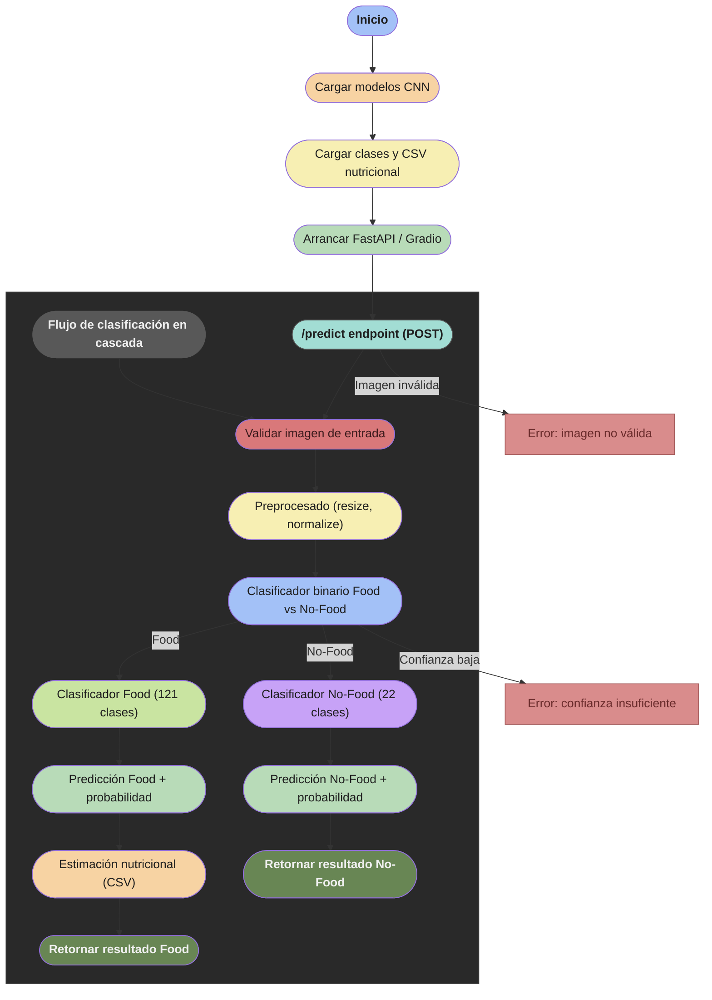

# Analizador de Calorías (Pre-Alpha)

Sistema modular basado en **Deep Learning (CNN + Transfer Learning)** para detectar si una imagen contiene **comida** o **no comida**, y clasificarla posteriormente en múltiples categorías usando un **pipeline en cascada**.

> **Versión Beta disponible:**  
> La versión funcional en producción de este sistema se encuentra desplegada en mi portfolio personal: https://gcodev.es/  
>  
> Esta versión incluye una interfaz interactiva, backend operativo y mejoras respecto a este repositorio, que actúa como **base técnica y experimental** del proyecto.

---
---
##  Resumen

Este proyecto implementa una arquitectura en **cascada de tres capas**:

-  **Filtro binario**: clasificación `food` vs `no_food`
-  **Clasificador de alimentos**: 121 clases (Food-101 ampliado)
-  **Clasificador no-food**: 22 categorías (personas, animales, paisajes, objetos...)

Incluye además un módulo de **estimación nutricional** (calorías y macronutrientes) basado en un CSV nutricional.

Se proporcionan:
- Notebooks reproducibles  
- Scripts de entrenamiento e inferencia  
- Backend FastAPI  
- UI Gradio  
- Docker para despliegue

### Notebooks

Puedes ejecutar y descargar los notebooks desde este repositorio:

- [Demo Analizador de Calorías (Colab-ready)](notebooks/Analziador_de_Calorías_computer vision.ipynb)
---

## Objetivo

Crear un sistema:
- Reproducible y modular
- Preparado para producción
- Fácilmente extensible (nuevas clases, modelos o fuentes de datos)
- Capaz de integrarse en aplicaciones externas (mobile / web / IoT)

---

## Tabla de contenidos

- [Descripción](#descripción)
- [Objetivo](#objetivo)
- [Arquitectura](#arquitectura)
- [Características](#características)
- [Estructura del repositorio](#estructura-del-repositorio)
- [Requisitos](#requisitos)
- [Instalación](#instalación)
- [Entrenamiento](#entrenamiento)
- [Inferencia](#inferencia)
- [API (FastAPI)](#api-fastapi)
- [Interfaz Gradio](#interfaz-gradio)
- [Docker](#docker)
- [Modelos y datos](#modelos-y-datos)
- [Notas técnicas](#notas-técnicas)
- [Estado del proyecto](#estado-del-proyecto)
- [Contribuir](#contribuir)
- [Licencia](#licencia)

---

## Descripción

Este proyecto implementa un **clasificador en cascada** que:

1. Determina si una imagen es **food** o **no_food**
2. Si es *food*, la clasifica entre **hasta 121 tipos de comida**
3. Si es *no_food*, la clasifica en **22 categorías contextuales**
4. Asocia predicciones de comida con **información nutricional estimada**
5. Expone el sistema mediante **API REST (FastAPI)** y **UI (Gradio)**


---

## Arquitectura
```text
Imagen
│
▼
[ Binary Classifier ]
│
├── food ─────▶ [ Food Classifier (121 clases) ] ─▶ Nutrición
│
└── no_food ──▶ [ No-Food Classifier (22 clases) ]
```

### Detalles técnicos
- Backbone: **EfficientNet (timm)**
- Transfer learning + fine-tuning
- Albumentations para data augmentation
- Mixed Precision Training (AMP)
- AdamW + class weighting
- Inferencia con umbral configurable

---

## Diagrama de Flujo




---

## Características

- Clasificación en cascada (binario → multiclase)
- Entrenamiento configurable por modo
- Inferencia local o vía API
-  Estimación nutricional desde CSV
-  UI interactiva con Gradio
- ✅ Docker listo para despliegue
- ✅ Compatible con Google Colab

---

## Estructura del repositorio

```text
.
├── app_fastapi.py          # API REST
├── app_gradio.py           # UI Gradio (cliente o local)
├── main.py                 # Demo local Gradio
├── train.py                # Entrenamiento (binary / food / nofood)
├── inference_cascade.py    # Pipeline de inferencia
├── utils.py                # Utilidades comunes
├── models/                 # clases.txt, checkpoints
├── model/                  # modelos .pth
├── data/
│   └── nutrition_food101_merged.csv
├── Dockerfile
├── requirements.txt
└── README.md
```


---

## Requisitos

- Python ≥ 3.9
- PyTorch
- GPU recomendada (para entrenamiento)

Principales librerías:
- `torch`, `timm`
- `albumentations`
- `fastapi`, `uvicorn`
- `gradio`
- `pandas`, `numpy`, `scikit-learn`

---

## Instalación

```bash
pip install -r requirements.txt
```

Instalación manual mínima:
```
pip install timm==0.9.2 albumentations==1.3.0 torchmetrics scikit-learn
pip install fastapi uvicorn gradio pandas numpy
```
---

---

## Entrenamiento

El script `train.py` soporta tres modos:

- `binary`
- `food`
- `nofood`

### Ejemplo (binario)

```bash
python train.py \
  --mode binary \
  --data_dir /path/Food-101 \
  --no_food_dir /path/no_food \
  --model_dir ./models \
  --epochs 10 \
  --bs 32 \
  --img_size 192

```
---

##  Inferencia

```from inference_cascade import predict_single

result = predict_single("image.jpg", bin_thresh=0.5)
print(result)
```
Salida típica: (food, "pizza", 0.94)

---

## Entrenamiento

El script `train.py` soporta tres modos:

- `binary`
- `food`
- `nofood`

### Ejemplo (binario)

```bash
python train.py \
  --mode binary \
  --data_dir /path/Food-101 \
  --no_food_dir /path/no_food \
  --model_dir ./models \
  --epochs 10 \
  --bs 32 \
  --img_size 192
Los modelos y archivos de clases se guardan automáticamente en --model_dir.
```

---

## Inferencia
Inferencia en cascada sobre una imagen:
```
from inference_cascade import predict_single

result = predict_single("image.jpg", bin_thresh=0.5)
print(result)
```
Salida típica:
```
(food, "pizza", 0.94)
```
---

## API (FastAPI)
Lanzar servidor
```
uvicorn app_fastapi:app --host 0.0.0.0 --port 8000
Endpoint principal
POST /predict

curl -X POST "http://localhost:8000/predict?topk=3" \
  -F "file=@image.jpg"
```
Devuelve:
```
Predicción top-k
```
Probabilidades

Información nutricional estimada (si aplica)

---

## Interfaz Gradio
python app_gradio.py
# 
python main.py
Opcionalmente, puede consumir la API remota configurando:

export BACKEND_URL="http://localhost:8000"

---

## Docker

Construir imagen

docker build -t food-classifier .
Ejecutar
docker run -p 8000:8000 food-classifier
Puedes montar volúmenes para modelos y datos si lo prefieres.

## Modelos y datos

- Food: Food-101 + platos adicionales (121 clases)
- No-food: 22 categorías
- Nutrición: CSV con calorías y macronutrientes estimados

⚠️ Asegúrate de que `classes_*.txt` coincidan exactamente con los checkpoints usados.

---

## Notas técnicas

- Copiar datasets desde Google Drive a disco local mejora significativamente el rendimiento
- En Colab, usar `workers=0` si hay bloqueos del `DataLoader`
- Los checkpoints pueden requerir limpieza de prefijos (`module.`)
- El proyecto utiliza label smoothing por defecto

---

##  Estado del proyecto

- 🟡 Pre-alfa
- Código funcional
- Falta hardening para producción (tests, validaciones, seguridad)
- Ideal para investigación, demos y prototipos

---

## 🤝 Contribuir

- Abrir un issue
- Crear una rama (`feature/...` o `fix/...`)
- Enviar un Pull Request con una descripción clara

---

## 📄 Licencia

Pendiente de definir (recomendado: MIT).


